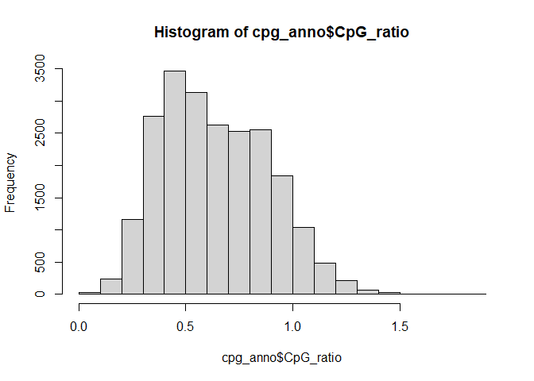
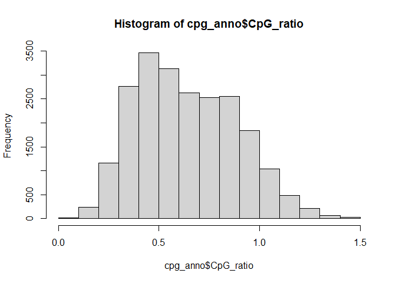
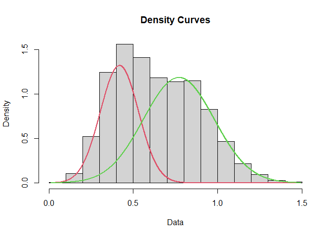
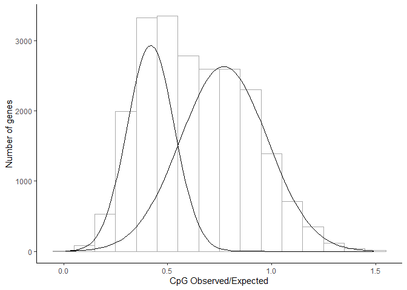

Sea Urchin CpG O/E Calculations
================
Author: Emma Strand; <emma.strand@gmgi.org>

## Load libraries

``` r
library(plyr)
library(dplyr)
```

    ## 
    ## Attaching package: 'dplyr'

    ## The following objects are masked from 'package:plyr':
    ## 
    ##     arrange, count, desc, failwith, id, mutate, rename, summarise,
    ##     summarize

    ## The following objects are masked from 'package:stats':
    ## 
    ##     filter, lag

    ## The following objects are masked from 'package:base':
    ## 
    ##     intersect, setdiff, setequal, union

``` r
library(ggplot2)
library(mixtools)
```

    ## Warning: package 'mixtools' was built under R version 4.3.2

    ## mixtools package, version 2.0.0, Released 2022-12-04
    ## This package is based upon work supported by the National Science Foundation under Grant No. SES-0518772 and the Chan Zuckerberg Initiative: Essential Open Source Software for Science (Grant No. 2020-255193).

``` r
library(fitdistrplus)
```

    ## Warning: package 'fitdistrplus' was built under R version 4.3.2

    ## Loading required package: MASS

    ## 
    ## Attaching package: 'MASS'

    ## The following object is masked from 'package:dplyr':
    ## 
    ##     select

    ## Loading required package: survival

## Load data

``` r
cpg_anno <- read.delim("../MRF_CpG.txt", header=FALSE) %>%
  dplyr::rename(Gene = V1) %>% dplyr::rename(CpG_ratio = V2)

set.seed(101)
```

## Choosing cut-offs

``` r
range(cpg_anno$CpG_ratio) ## 0.00000 1.82588
```

    ## [1] 0.00000 1.82588

``` r
hist(cpg_anno$CpG_ratio)
```

<!-- -->

``` r
cpg_anno <- cpg_anno %>% 
  filter(CpG_ratio >= 0.001) %>% # setting minimum
  filter(CpG_ratio <= 1.5) # setting maximum 

range(cpg_anno$CpG_ratio) ## 0.00990199 1.49170000
```

    ## [1] 0.00990199 1.49170000

``` r
hist(cpg_anno$CpG_ratio) 
```

<!-- -->

## Fitting mixture model with mixtools normalmixEM

<https://dozenoaks.twelvetreeslab.co.uk/2019/06/mixture-models/>

`normalmixEM` functions is telling it to find two gaussians in the
observations

``` r
mixmodel <- normalmixEM(cpg_anno$CpG_ratio, k = 2)
```

    ## number of iterations= 282

``` r
plot(mixmodel, which = 2)
```

<!-- --> \###
Plotting the above model

``` r
cpg_anno %>% 
  ggplot(., aes(x=CpG_ratio)) + theme_classic() + 
  geom_histogram(binwidth=0.1, fill = "white", color="darkgrey", alpha=0.9) + 
  ylab("Number of genes") + xlab("CpG Observed/Expected") +
  mapply(
    function(mean, sd, lambda, n, binwidth) {
      stat_function(
        fun = function(x) {
          (dnorm(x, mean = mean, sd = sd)) * n * binwidth * lambda
        }
      )
    },
    mean = mixmodel[["mu"]], #mean
    sd = mixmodel[["sigma"]], #standard deviation
    lambda = mixmodel[["lambda"]], #amplitude
    n = length(cpg_anno$CpG_ratio), #sample size
    binwidth = 0.1 #binwidth used for histogram; needs to match the above binwidth 
  )
```

<!-- -->
