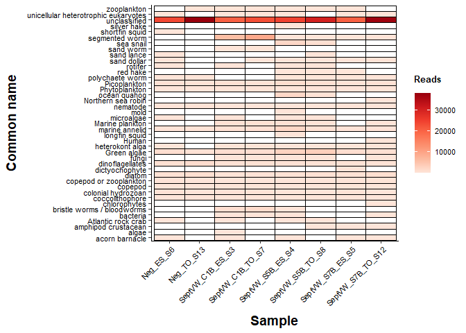

COI contamination issues
================
Author: Emma Strand; <emma.strand@gmgi.org>

## COI contamination issues

Load libraries

``` r
library(ggplot2)
library(tidyverse)
```

    ## ── Attaching core tidyverse packages ──────────────────────── tidyverse 2.0.0 ──
    ## ✔ dplyr     1.1.3     ✔ readr     2.1.4
    ## ✔ forcats   1.0.0     ✔ stringr   1.5.0
    ## ✔ lubridate 1.9.3     ✔ tibble    3.2.1
    ## ✔ purrr     1.0.2     ✔ tidyr     1.3.0
    ## ── Conflicts ────────────────────────────────────────── tidyverse_conflicts() ──
    ## ✖ dplyr::filter() masks stats::filter()
    ## ✖ dplyr::lag()    masks stats::lag()
    ## ℹ Use the conflicted package (<http://conflicted.r-lib.org/>) to force all conflicts to become errors

``` r
library(readxl)
library(writexl)
library(naniar)
```

Load data

``` r
seq <- read.delim2(file="scripts/eDNA ampliseq test/COI/BLASToutput/BLASTResults_COIcontamination99.txt", header=F) %>%
  dplyr::rename(ASV_ID = V1) %>% arrange(ASV_ID)
length(unique(seq$ASV_ID)) ## 100% = 52; 99% = 121
```

    ## [1] 121

``` r
counts <- read_tsv(file = "scripts/eDNA ampliseq test/COI/ASV_table.tsv")  
```

    ## Rows: 1175 Columns: 9
    ## ── Column specification ────────────────────────────────────────────────────────
    ## Delimiter: "\t"
    ## chr (1): ASV_ID
    ## dbl (8): Neg_ES_S6, Neg_TO_S13, SeptVW_C1B_ES_S3, SeptVW_C1B_TO_S7, SeptVW_S...
    ## 
    ## ℹ Use `spec()` to retrieve the full column specification for this data.
    ## ℹ Specify the column types or set `show_col_types = FALSE` to quiet this message.

``` r
counts <- counts %>% mutate(Total = rowSums(.[2:9]))
length(unique(counts$ASV_ID)) ## 1,175
```

    ## [1] 1175

``` r
data <- full_join(seq, counts, by = "ASV_ID")

data_annotated <- data %>% filter(!is.na(V2)) %>% arrange(desc(Total)) 

data_annotated %>% write_xlsx("scripts/eDNA ampliseq test/COI/BLASToutput/BLASToutput99.xlsx")
```

Edited with NCBI annotation of species and common names.

``` r
names <- read_xlsx("scripts/eDNA ampliseq test/COI/BLASToutput/BLASToutput99_annotated.xlsx") %>%
  dplyr::select(1,3:4) %>% distinct()

df2 <- data %>% dplyr::select(1,13:21) %>%
  distinct() %>%
  full_join(., names, by = join_by(ASV_ID)) %>%
  mutate(Species = if_else(is.na(Species), "unclassified", Species),
         `Common name` = if_else(is.na(`Common name`), "unclassified", `Common name`))
```

Plotting

``` r
df2 %>% dplyr::select(-Total, -Species) %>% distinct() %>%
  gather(., "sample", "value", 2:9) %>%
  group_by(`Common name`, sample) %>%
  mutate(total = sum(value)) %>% dplyr::select(-ASV_ID, -value) %>% distinct() %>%
  replace_with_na_all(condition = ~.x == 0.000000000) %>%
  arrange(desc(total)) %>%
  ggplot(., aes(x=sample, y=`Common name`)) +
  geom_tile(aes(fill = total), color = "black") +
  theme_classic() +
  labs(fill = "Reads") + 
  xlab("Sample") +
  scale_fill_distiller(type = "seq", na.value = "white", 
                       palette = "Reds", direction=1) + 
  theme(axis.text.x = element_text(angle = 45, size=8, color="black", hjust = 1),
        legend.text = element_text(size = 8, color="black"),
        legend.title = element_text(margin = margin(t = 0, r = 0, b = 5, l = 0), size=10, color="black", face="bold"),
        axis.title.y = element_text(margin = margin(t = 0, r = 10, b = 0, l = 0), size=14, face="bold"),
        axis.title.x = element_text(margin = margin(t = 10, r = 0, b = 0, l = 0), size=14, face="bold"),
        axis.text.y = element_text(colour = 'black', size = 8)) 
```

<!-- -->

``` r
head(
  df2 %>% dplyr::select(-Total, -Species) %>% distinct() %>%
  gather(., "sample", "value", 2:9) %>%
  group_by(`ASV_ID`) %>%
  mutate(total = sum(value)) %>% dplyr::select(-value, -sample) %>% distinct() %>%
  subset(`Common name` == "unclassified") 
)
```

    ## # A tibble: 6 × 3
    ## # Groups:   ASV_ID [6]
    ##   ASV_ID                           `Common name` total
    ##   <chr>                            <chr>         <dbl>
    ## 1 f782b5c934941bc568e67597233f762b unclassified  93335
    ## 2 41c6c4e4b8ce8c1b6e5a6fda372db79c unclassified  13164
    ## 3 ac2a039ac3fc7780e8e3eb3e58374df1 unclassified  11327
    ## 4 4e7b375554fd7ba631d9af95e2ccad5d unclassified   8187
    ## 5 c74fe75b309859664502215266b64bad unclassified   7198
    ## 6 32ddbf2304602d7d57c12b59a47bc0cd unclassified   4890
